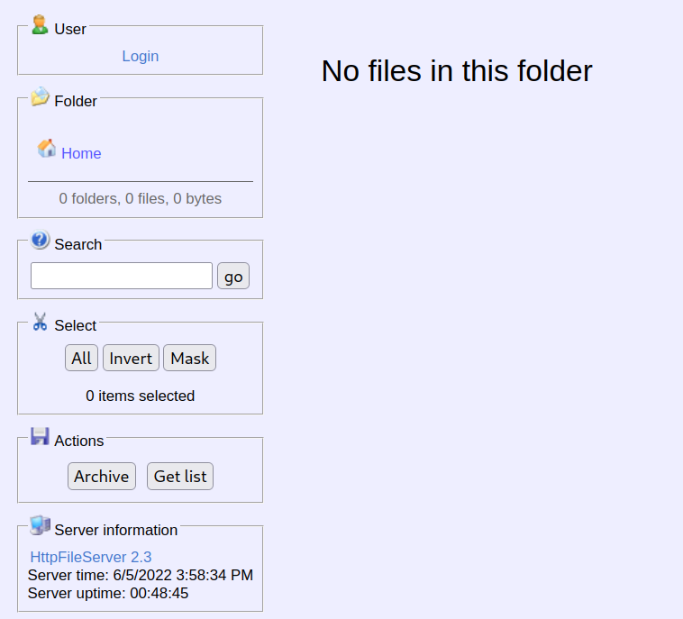
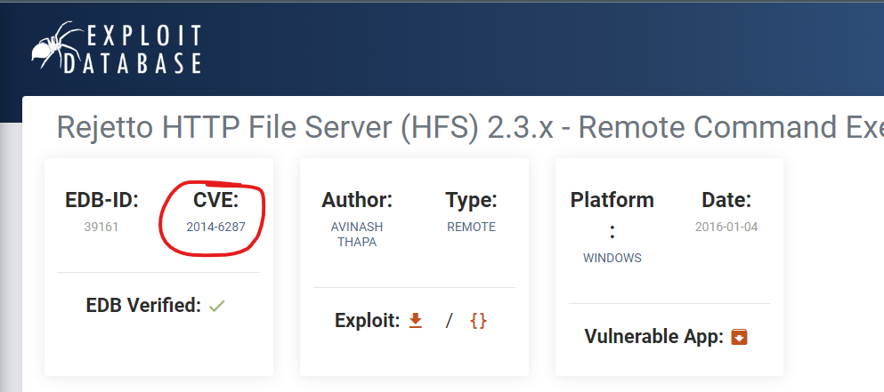
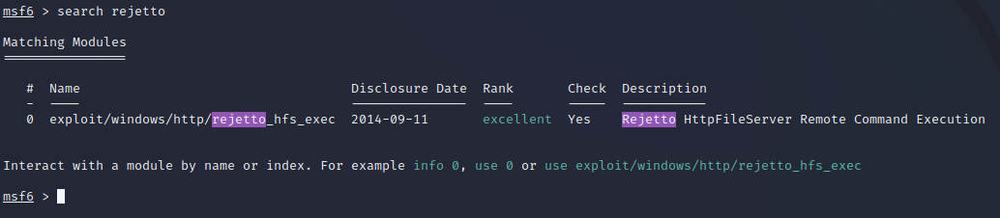

# Steel Mountain
This is a write up for the TryHackMe room [Steel Mountain](https://tryhackme.com/room/steelmountain).

## Table of Contents
- [Task 1 Introduction](#task-1-introduction)
  * [Question: Who is employee of the month?](#question--who-is-employee-of-the-month-)
- [Task 2 Initial Access](#task-2-initial-access)
  * [Question: Scan the machine with nmap. What is the other port running a web server on?](#question--scan-the-machine-with-nmap-what-is-the-other-port-running-a-web-server-on-)
  * [Question: Take a look at the other web server. What file server is running?](#question--take-a-look-at-the-other-web-server-what-file-server-is-running-)
  * [Question: What is the CVE number to exploit this file server?](#question--what-is-the-cve-number-to-exploit-this-file-server-)
  * [Question: Use Metasploit to get an initial shell. What is the user flag?](#question--use-metasploit-to-get-an-initial-shell-what-is-the-user-flag-)
- [Task 3 Privilege Escalation](#task-3-privilege-escalation)
  * [Question: What is the name of the service which shows up as an unquoted service path vulnerability?](#question--what-is-the-name-of-the-service-which-shows-up-as-an-unquoted-service-path-vulnerability-)
  * [Question: What is the root flag?](#question--what-is-the-root-flag-)
- [Task 4 Access and Escalation Without Metasploit](#task-4-access-and-escalation-without-metasploit)
  * [Question: What powershell -c command could we run to manually find out the service name?](#question--what-powershell--c-command-could-we-run-to-manually-find-out-the-service-name-)

<small><i><a href='http://ecotrust-canada.github.io/markdown-toc/'>Table of contents generated with markdown-toc</a></i></small>


## Task 1 Introduction


Press "Start Machine" and wait for the machine to boot up. Since it's a Windows machine it may take more than a minute to boot up fully.

Open a Terminal window. For convenience, store the IP address in a local variable, like this:
```
$ TARGET_IP=10.10.57.65
```
During my writeup I had the IP `10.10.57.65`. You will have another one.

### Question: Who is employee of the month?
- Hint: Reverse image search

1. Copy the IP address and paste it into your web browser on your attack box or your own VPN-connected machine. You shold see the page shown below:
   <br/>

2. Right click and "View Page Source". 

3. Find the source of the img tag to find the answer.
    ```
    // snip //
    <h3>Employee of the month</h3>
    
    </center>
    // snip //
    ```

## Task 2 Initial Access

### Question: Scan the machine with nmap. What is the other port running a web server on?

1. In the previously opened Terminal window, type
   ```
    $ nmap -sV $TARGET_IP
   ```
   The -sV option will give us versions of found services.

   Which will give the following reponse
   ```
    Starting Nmap 7.92 ( https://nmap.org ) at 2022-06-05 18:32 EDT
    Nmap scan report for 10.10.57.65
    Host is up (0.048s latency).
    Not shown: 989 closed tcp ports (conn-refused)
    PORT      STATE SERVICE            VERSION
    80/tcp    open  http               Microsoft IIS httpd 8.5
    135/tcp   open  msrpc              Microsoft Windows RPC
    139/tcp   open  netbios-ssn        Microsoft Windows netbios-ssn
    445/tcp   open  microsoft-ds       Microsoft Windows Server 2008 R2 - 2012 microsoft-ds
    3389/tcp  open  ssl/ms-wbt-server?
    8080/tcp  open  http               HttpFileServer httpd 2.3
    49152/tcp open  msrpc              Microsoft Windows RPC
    49153/tcp open  msrpc              Microsoft Windows RPC
    49154/tcp open  msrpc              Microsoft Windows RPC
    49155/tcp open  msrpc              Microsoft Windows RPC
    49156/tcp open  msrpc              Microsoft Windows RPC
    Service Info: OSs: Windows, Windows Server 2008 R2 - 2012; CPE: cpe:/o:microsoft:windows

    Service detection performed. Please report any incorrect results at https://nmap.org/submit/ .
    Nmap done: 1 IP address (1 host up) scanned in 72.84 seconds
    ```
    2. As we can see there is also another `port 8080` using the http service, under the SERVICE column. This is the answer.

### Question: Take a look at the other web server. What file server is running?
    
1. As we can see from the nmap output above port 8080 uses "HttpFileServer httpd 2.3". 

2. Go to http://TARGET_IP:8080
    <br/> 
    <br>
    to view the page. There is also a confirmation of the "HttpFileServer 2.3" service being used.

3. Search for `HttpFileServer httpd 2.3` in your favorite search tool. You should find the full name "Rejetto HTTP File Server". 

### Question: What is the CVE number to exploit this file server?

1. One of the highest search hits is probably https://www.exploit-db.com/exploits/39161. This specific version of Rejetto File Server has a Remote Code Execution (RCE) vulnerability!
     <br/> 
     

### Question: Use Metasploit to get an initial shell. What is the user flag?
1. On you machine/attackbox start `msfconsole` i the terminal window to start Metasploit.
2. When Metasploit has started, type `search rejetto` to find available exploits for Rejetto File Server.

3. Write `use 0` to use the exploit.
4. We need to set a number of options for this exploit. Type `show options` to show all available options.

## Task 3 Privilege Escalation

### Question: What is the name of the service which shows up as an unquoted service path vulnerability?

### Question: What is the root flag?

## Task 4 Access and Escalation Without Metasploit

### Question: What powershell -c command could we run to manually find out the service name?
